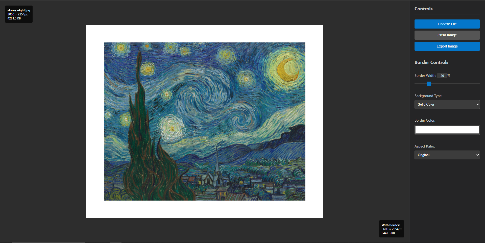

# Image Border Editor

A simple web-based tool for adding borders to images. Load an image, adjust the border settings, and export the result.

## Features

- **Drag & Drop Interface** - Load images by clicking or dragging and dropping
- **Adjustable Borders** - Real-time border width adjustment with smooth slider
- **Color Picker** - Choose any border color with built-in color picker
- **Blur Backgrounds** - Add stylish blurred background effects
- **Aspect Ratios** - Preset ratios for social media (1:1 square, 4:5 Instagram, 16:9, etc.)
- **Smart Export** - Preserves original file format and quality
- **Privacy First** - Works entirely in the browser - no uploads required
- **High Resolution** - Maintains full image quality in exports

## Quick Start

### Option 1: Easy Install (Windows)
1. Download the project files
2. Create desktop and Start Menu shortcuts
3. Double-click the "Border Tool" shortcut to open

### Option 2: Direct Use
1. Download and open `index.html` in your web browser
2. Click "Choose File" or drag an image onto the upload area
3. Adjust settings:
   - **Border Width**: Use the slider (0-100%)
   - **Border Color**: Click the color picker
   - **Background**: Choose solid color or blur effect
   - **Aspect Ratio**: Select preset ratios or keep original
4. Click "Export Image" to download your bordered image

## Supported Formats

- **Input**: JPG, PNG, GIF, WebP, and most common image formats
- **Output**: Same format as input (preserves JPG, PNG, etc.) with high quality

## Browser Requirements

Works in any modern web browser that supports HTML5 Canvas API.

## License

Open source - feel free to modify and use as needed.